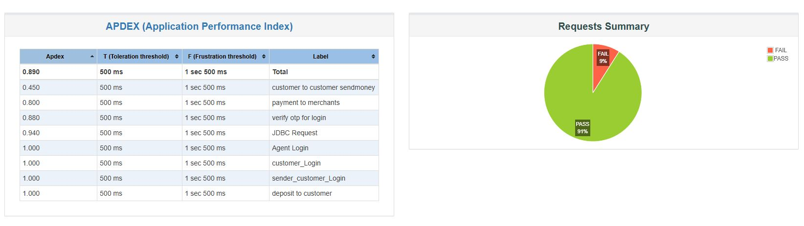
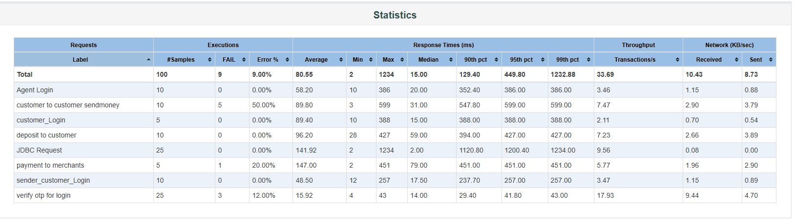

# 🚀 JMeter Performance Testing for Dmoney API

[](https://jmeter.apache.org/)
[](https://oracle.com/java)
[](https://github.com/Fahadhossain99/jmeter-performance-testing)
[](https://github.com/Fahadhossain99/jmeter-performance-testing)
## ⚡ Project Overview

This project presents a **performance testing implementation of the Dmoney API** using **Apache JMeter**. The main goal was to simulate real-world transaction activities and evaluate system performance through multiple user interactions.

The testing covered three key transaction modules:

- **Deposit:** 5 agents deposited money for 10 customers  
- **Send Money:** 5 customers transferred money to other customers  
- **Payment:** 5 customers made payments to 2 merchants  

To ensure realistic execution, separate **CSV files** were used for test data management, while **dynamic transaction amounts** were generated using the **Random Variable Controller**. Proper **assertions** and an **HTML performance report** were included to verify successful transactions and analyze overall system behavior.

### 👥 Thread Groups & Dataset

All scenarios are executed using separate datasets for each transaction type.

| Scenario Name | Target flow description | Dataset Source |
| :--- | :--- | :--- |
| **1. Agent Deposit** | Agent logins, OTP validation, and deposit into customer accounts. | [`deposit.csv`](Resources/deposit.csv) |
| **2. Send Money** | Customer logins, OTP verification, and money transfer to other customers. | [`sendMoney.csv`](Resources/sendMoney.csv) |
| **3. Merchant Payment** | Customer logins, OTP verification, and merchant payment transactions. | [`payment.csv`](Resources/payment.csv) |

## 📊 Performance Test Reports

After executing the JMeter test plan, performance results were generated in **HTML format** along with Summary and Aggregate reports. These reports provide a clear overview of system behavior under different transaction loads.

The HTML report includes key performance metrics such as:
- Response time statistics
- Error percentage
- Throughput
- Request summary

### 🖼️ HTML Report Screenshots
### 📌 Request Summary Report



### 📌 Statistics Report




## 📌 Notes

- All test results are generated from `dmoney.jmx` execution.
- CSV datasets were used for dynamic and realistic transaction simulation.
- The HTML report is used to analyze system performance visually and identify failures or bottlenecks.

## 🛠️ Installation & Execution Guide

Follow these instructions to clone, open, and execute the performance suite locally.

### 📋 Prerequisites
* **Java**: JDK 8 or higher installed and configured in system path.
* **JMeter**: [Apache JMeter 5.6.x](https://jmeter.apache.org/download_jmeter.cgi) or higher.

### 🏃 Running via JMeter GUI
1. Clone this repository to your local machine:
   ```bash
   git clone https://github.com/Fahadhossain99/jmeter-performance-testing.git
   ```
2. Open **Apache JMeter**.
3. Go to `File` > `Open` and select the `dmoney.jmx` file from the root folder.
4. Click the **Start (Green Triangle)** button to run the test suite. All CSV configurations use relative paths and will load automatically.

### 🖥️ Running via Command Line (CLI Mode)
To avoid GUI resource overhead and get high-accuracy performance measurements, run the test plan from your terminal:

```bash
jmeter -n -t dmoney.jmx -l report.jtl -e -o Reports/
```

* **`-n`**: Specifies non-GUI mode.
* **`-t`**: Path to the source `.jmx` test plan.
* **`-l`**: Name of the JTL file to log results.
* **`-e`**: Generates a rich HTML report dashboard after execution.
* **`-o`**: Output folder where the dashboard will be written.

## 👤 Author

Fahad Hossain Emon  
🔗 LinkedIn: https://www.linkedin.com/feed/  
✉️ Email: fahadhossain0323@gmail.com


## 🎯 Conclusion
This project helped to understand real-world API performance testing using JMeter, especially how multiple users interact with financial transactions under load. Proper test data management, dynamic inputs, and report analysis played an important role in achieving accurate results.
